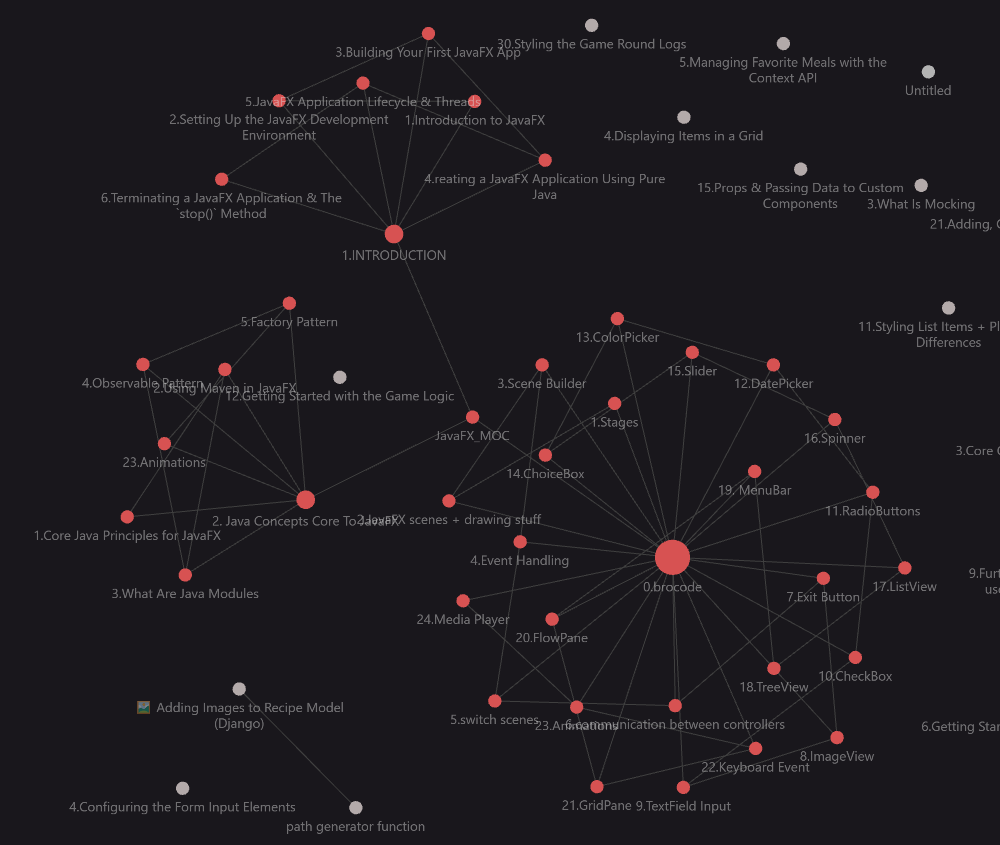
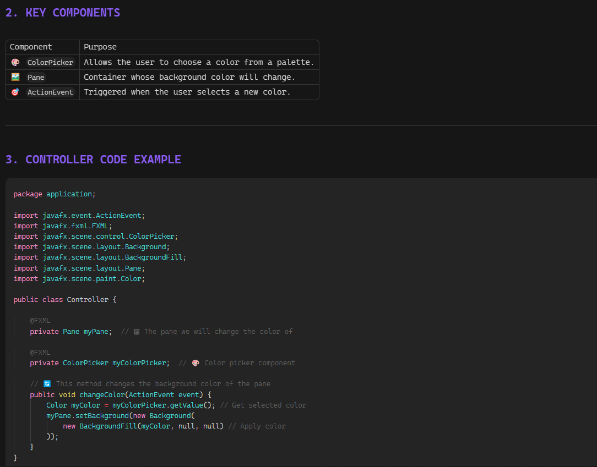

<div align="center">
  
  &nbsp;&nbsp;&nbsp;&nbsp;&nbsp;&nbsp;&nbsp;&nbsp;
  
  &nbsp;&nbsp;&nbsp;&nbsp;&nbsp;&nbsp;&nbsp;&nbsp;
  
  
  # JavaFX Mastery Vault
  **A fully interconnected, visually stunning Obsidian Knowledge Base for JavaFX.**

  [](https://www.java.com/)
  [](https://openjfx.io/)
  [](https://obsidian.md/)
</div>

---

## 🌟 The Vault in Action

This is not just a list of markdown files; it's a **living knowledge graph**. Every concept, UI component, and script is deeply linked to form a comprehensive web of understanding.

### 🕸️ Knowledge Graph View
The vault is heavily interconnected. The **Map of Content** acts as a central hub, while individual course notes link sequentially to guide your learning path.


### 📖 Course Notes View
Clean, readable, and perfectly formatted notes designed specifically for Obsidian, complete with custom navigation and back-links.


---

## 📂 Vault Structure

The repository is logically organized into distinct categories to keep the knowledge base clean and accessible.

```text
📦 javafx-knowledge-base
 ┣ 📜 JavaFX_MOC.md                <-- The Central Hub (Map of Content)
 ┣ 📜 README.md                    
 ┣ 📜 LICENSE                      <-- MIT License
 ┣ 📂 assets                       <-- Images and visual assets for the vault
 ┃ ┣ 🖼️ coursView.png
 ┃ ┗ 🖼️ graphView.png
 ┣ 📂 0.brocode                    <-- UI Components, Events & Animations
 ┃ ┣ 📜 0.brocode.md               <-- Folder Map of Content
 ┃ ┣ 📜 1.Stages.md
 ┃ ┣ 📜 2.JavaFX scenes + drawing stuff.md
 ┃ ┣ ... (24 detailed modules on JavaFX features)
 ┣ 📂 1.INTRODUCTION               <-- Basics and Getting Started
 ┃ ┣ 📜 1.INTRODUCTION.md          <-- Folder Map of Content
 ┃ ┗ ... (Introductory topics)
 ┗ 📂 2. Java Concepts Core To JavaFX <-- Essential Java Prerequisites
   ┣ 📜 2. Java Concepts Core To JavaFX.md
   ┗ ... (Notes on Java concepts crucial for JavaFX)
```

## 🧭 Navigation & Workflow

1. **Map of Content (MOC)**: Start your journey at `JavaFX_MOC.md`. It acts as the index for the entire vault.
2. **Folder Notes**: Every major directory contains its own localized MOC (e.g., `0.brocode.md`).
3. **Sequential Learning**: Every note features a custom `Navigation` header. This allows you to smoothly transition to the `Previous` or `Next` note in the series, or jump `Up` to the folder's MOC.

## 🛠️ Getting Started

1. **Download Obsidian**: Get it for free at [obsidian.md](https://obsidian.md/).
2. **Clone the Vault**:
   ```bash
   git clone https://github.com/BenhamadaKhalil/javafx.git
   ```
3. **Open in Obsidian**: Open Obsidian, click **"Open folder as vault"**, and select the cloned directory.
4. **Explore the Graph**: Press `Ctrl+G` (or `Cmd+G` on Mac) to open the Graph View and watch the connections come to life!

---

## 🗺️ Roadmap

- [x] Establish the core Map of Content (`JavaFX_MOC.md`).
- [x] Implement interconnected breadcrumb navigation (Previous/Next/Up) across all files.
- [x] Document fundamental UI components, layouts, and event handling (`0.brocode`).
- [x] Include core Java prerequisite concepts needed for JavaFX.
- [ ] Add advanced styling notes (JavaFX CSS).
- [ ] Include detailed Cheat Sheets in a dedicated directory.
- [ ] Document real-world integration examples and sample projects.

---

## 📄 License

This repository is licensed under the MIT License. See the [LICENSE](LICENSE) file for more details.

---

<div align="center">
  <i>Curated and maintained with ❤️ for the JavaFX community.</i>
</div>
